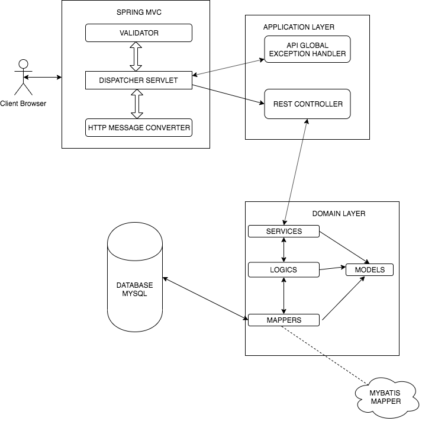
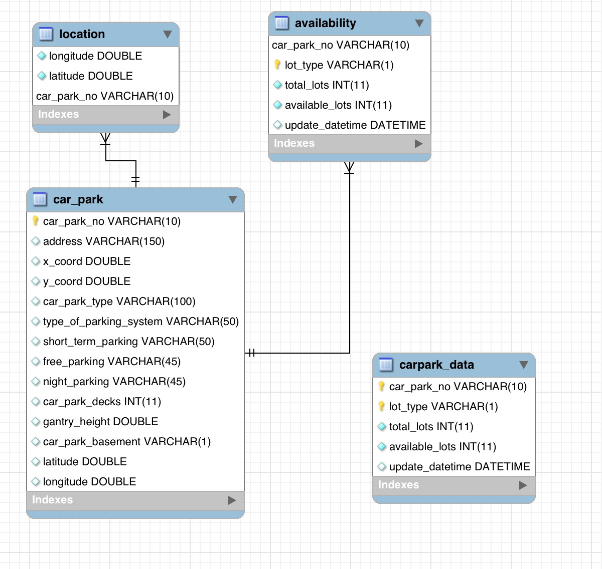

# What you'll build
- Set up an API-only application that would return the closest carparks to a user with the parking lot availability

# What you'll need
For building and running the application you need:

- [Docker](https://docs.docker.com/docker-for-mac/install)

# Stack
- [Docker](https://docs.docker.com/docker-for-mac/install)
- [Java 8](https://www.oracle.com/technetwork/java/javase/downloads/jdk8-downloads-2133151.html)
- [Spring Boot](https://docs.spring.io/spring-boot/docs/current/reference/htmlsingle/)
- [MySQL](https://www.mysql.com/downloads/)
- [Gradle](https://gradle.org/install/)

## Installation

Use [docker-compose](https://docs.docker.com/compose/) to setup.

```bash
git clone https://github.com/vtnhanhcmus/carpark.git
cd carpark
cd deployment
sh setup.sh
docker-compose build
docker-compose up
Access to http://localhost/
```
If we have some problem about environment setting gradle. we don't need to run file setup.sh
i not sure about others pc, you can use the existing jar file (/deployment/carpark-api-0.0.1.jar)

```bash
git clone https://github.com/vtnhanhcmus/carpark.git
cd carpark
cd deployment
docker-compose build
docker-compose up
Access to http://localhost/
```

Setup with manual
```shell script
git clone https://github.com/vtnhanhcmus/carpark.git

# root folder project
cd carpark
./gradlew bootJar
cd carpark-api
java -jar -Dspring.profiles.active=develop build/libs/carpark-api-0.0.1.jar
Access to http://localhost:8080/
```

## Overview project


## Database 


## How to use 
* [api documents](carpark-api/APIDOCUMENT.md)